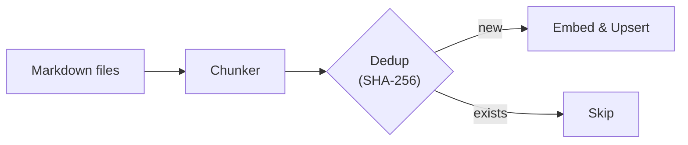
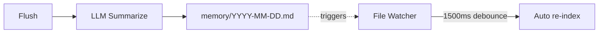
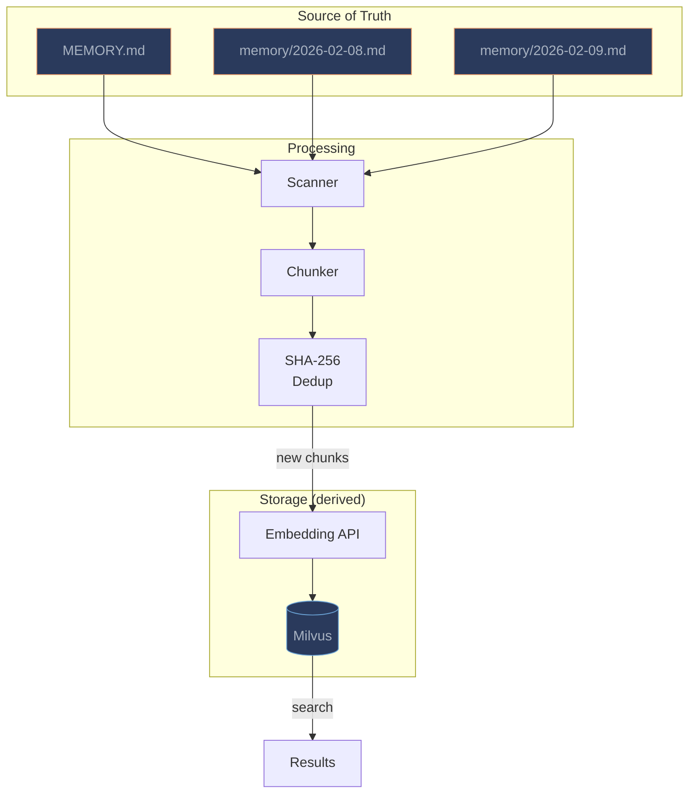

# Architecture

**Markdown is the source of truth** — the vector store is just a derived index, rebuildable anytime.

## Search Flow

## Ingest Flow

## Watch & Flush

## Key Design Decisions

### chunk_hash as Primary Key

Each chunk is identified by its SHA-256 content hash. This means:

- **Natural dedup** — identical content is never stored twice
- **No external cache** — the hash *is* the primary key in Milvus
- **Incremental indexing** — only new/changed chunks get embedded

### Single Collection

All agents share the `memsearch_chunks` collection. Physical isolation is achieved via different `milvus_uri` paths (each agent gets its own Milvus Lite database file).

### Data Flow Overview

### Security

The entire pipeline runs locally by default — your data never leaves your machine unless you choose a remote Milvus backend or a cloud embedding provider.
