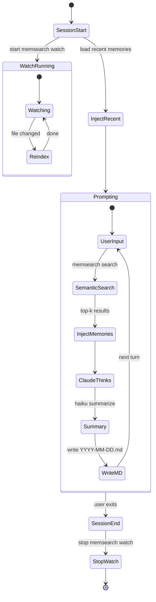

# Claude Code Plugin

memsearch ships with a Claude Code plugin that gives Claude **automatic persistent memory** across sessions.

## Install

```bash
pip install memsearch
claude --plugin-dir ./ccplugin
```

## How It Works



Under the hood: **4 shell hooks + 1 watch process**, all calling the `memsearch` CLI.

## Features

- **Zero config** — just install and go
- **Automatic** — memories are saved and recalled without manual commands
- **Transparent** — all memories are `.md` files, human-readable and git-friendly
- **Rebuildable** — the vector index can be rebuilt from markdown at any time

See [ccplugin/README.md](https://github.com/zilliztech/memsearch/tree/main/ccplugin) for the full architecture and hook details.
