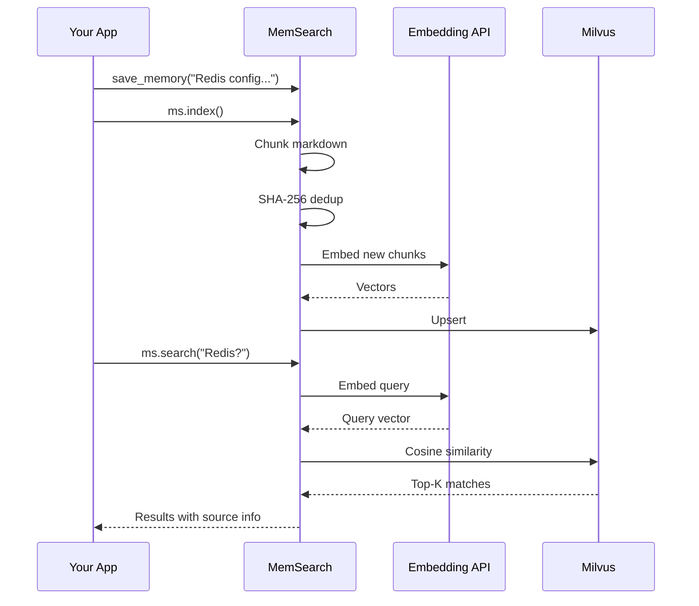
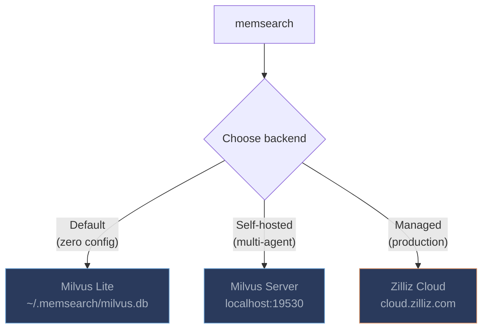

# Getting Started

## Installation

```bash
pip install memsearch
```

### With additional embedding providers

```bash
pip install "memsearch[google]"      # Google Gemini
pip install "memsearch[voyage]"      # Voyage AI
pip install "memsearch[ollama]"      # Ollama (local)
pip install "memsearch[local]"       # sentence-transformers (no API key)
pip install "memsearch[all]"         # Everything
```

## How It All Fits Together



## Your First Memory Search

```python
import asyncio
from memsearch import MemSearch

async def main():
    ms = MemSearch(paths=["./memory"])
    await ms.index()
    results = await ms.search("how to configure Redis?", top_k=3)
    for r in results:
        print(r["content"][:200])

asyncio.run(main())
```

## API Keys

Set the environment variable for your chosen provider:

```bash
export OPENAI_API_KEY="sk-..."       # OpenAI (default)
export GOOGLE_API_KEY="..."          # Google
export VOYAGE_API_KEY="..."          # Voyage
```

## Milvus Backends



### Milvus Lite (default)

```python
ms = MemSearch(paths=["./docs/"], milvus_uri="~/.memsearch/milvus.db")
```

Zero config, local file. Perfect for personal use.

### Milvus Server

```python
ms = MemSearch(paths=["./docs/"], milvus_uri="http://localhost:19530")
```

### Zilliz Cloud

```python
ms = MemSearch(paths=["./docs/"], milvus_uri="https://...", milvus_token="...")
```
